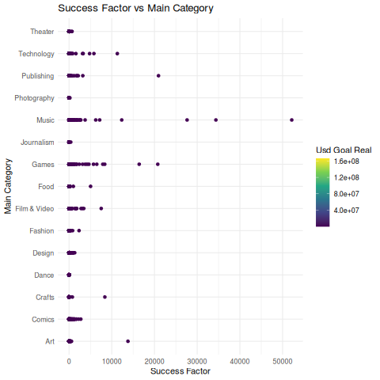
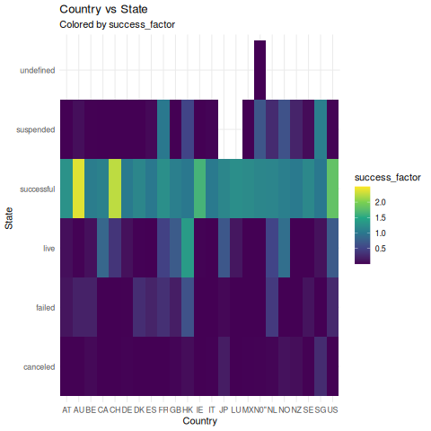

# Explore | Jake Gadaleta

## 0: Intro

All the starting points will mention what requirements they fill in the title.

Before we start I wanted to take the time to outline how this paper will be structured. The first 4 will be looking to answer the question of what categorical variables have the most impact on the success of the project. This section will be written to be read in a group with the figures as helper images. Finally all of the graphs will not be present in this report if you wish to see all the work I did (mostly just taking the figures out of the grid). please run `_png.R` and it will generate all of the figures. If you run `_svg.R` you will actually get higher quality images but it is very large and must be opened via the generated `zindex.html` file.

I really wanted to make a map with just a country count but it was producing a little bit too much of an issue installing the packages so I axed it.


## 1: Initial Scatter Plot : (ABE)

the very first thing I did was lay out what my categorical data was

```R
cat_val <- c("category", "main_category", "currency", "state", "country")
colnames(data)
'
 [1] "ID"               "name"             "category"         "main_category"   
 [5] "currency"         "deadline"         "goal"             "launched"        
 [9] "pledged"          "state"            "backers"          "country"         
[13] "usd_pledged"      "usd_pledged_real" "usd_goal_real" 
'
```

we then generated the success_factor by calculating a percentage of money gained, hence any value over 1 is a project that was fully funded, we also chose to add 1 to each end so that it never became multiplication by a decimal.
```R
data_scatter <- data %>%
 mutate(success_factor = ((usd_pledged_real+1)/(usd_goal_real + 1))) 
```

I then moved forward and made the first set of graphs, here is a sampling of that set of graphs




## 2: Removing the outliers : (ABCE)


In the last section the graphs were made difficult to read because of a few projects managed to be hugely successful. To remove the outliers I decided to mutate the data set in the following way

```R
filter(
    success_factor > (median(success_factor) - (sd(success_factor) * 3 ))
) %>%
filter(
    success_factor < (median(success_factor) + (sd(success_factor) * 3 ))
)
```

Now some of you are probably reading that and thinking "grrrrrrrrr `median` should instead be `mean`" but I chose to use the median value instead because those outliers really did skew the average out that much

I then moved everything out to a grid for easier analysis.


From here we can see the category that the variable with the highest impact is probably the main category.

## 3: The Histogram : (ABE)

I really quickly wanted to check that those conclusions that I jumped to in the last section to see if one section might be more popular just because it has more entires than all of the other one. In order to find this I generated the following grid


of course because I wanted to be really really really sure I also took the time to remove the outliers in the same fashion that I had done above.


From these two graphs we can come to the conclusion that the other graphs are good show some good information

## 4: The Heat Map : (ABCE)

With the heat map I decided to limit the success factor to 2.5, to be clear that means that the project was fully funded and then earned more than that, this number was chosen fairly arbitrarily because it made the pictures look the best, I did generate a heat map matching all for each cross section of categorical data but I've pulled out my favorite ones here

           




With these heat maps we can see how each categorical variable impacts each other. We can tell that the highest impact variable is definitely the Main Category, and while drilling down it became pretty obvious that if you want to have a successful KickStater the go to is either a video-game or a film/video project.

## 5: Bubble Graph (ACE)

I wanted to try something different with this one


One thing that should be said is that most projects tend to fail, which skewed this data hard, It's also really cool to see that it is very rare for a project to only slightly fail.

## 6: The One that Zooms (AF):

This graph literally just shows that I know how to zoom in


